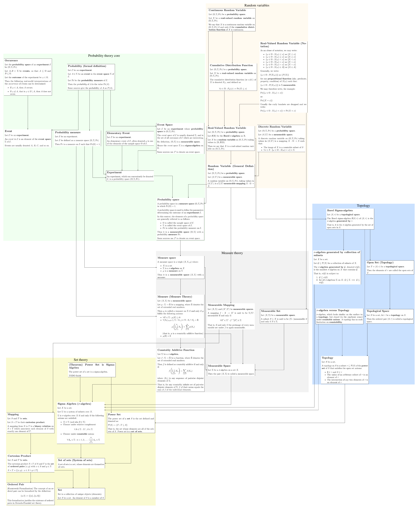

# Probability Theory: Rigorously, Visually, Without Tears

An attempt to understand and disentagle measure theory and probability theory from scratch.

Definitions are taken from the great https://proofwiki.org/ (Creative Commons Attribution-ShareAlike License)

(work in progress)

Run `build-graph.sh` to generate the final PDF `definitions.dot.pdf`. Requirements: pandoc, latex, etc.
